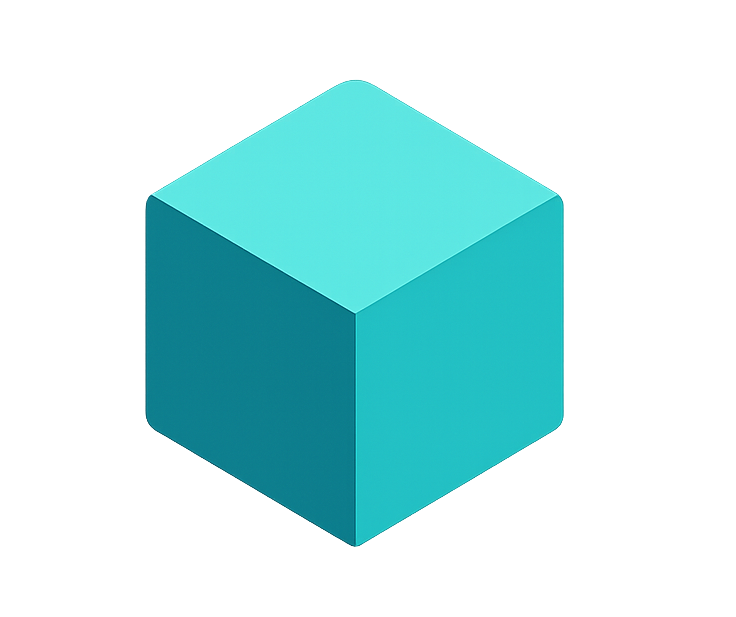

#  BountyPay

_Automated, trust-minimised bounty payouts for open-source contributions. Fund with USDC on Base or MUSD on Mezo and let BountyPay handle the rest._

**[Quick Demo Here](https://www.youtube.com/watch?v=fm-Y88apoTg)**

## Get Started in Minutes

1. **Install the GitHub App**  
   [Download BountyPay](https://github.com/apps/bountypay)

2. **Open a New Issue** and click the `Create a bounty` button from the BountyPay bot.

3. **Choose Your Network & Fund**
   - **Base Sepolia**: Fund with USDC (EVM standard)
   - **Mezo Testnet**: Fund with MUSD (Bitcoin L2)

   Funds sit safely in escrow.

4. **Merge the winning PR** — BountyPay automatically pays the contributor once the PR closes the issue.

That's it. No invoices, no manual transfers, no spreadsheets.

## Example Workflow

### As a Sponsor

1. Open an issue describing the work needed
2. Click "Create a bounty" in the bot comment
3. Connect your wallet and approve USDC spending
4. Fund the bounty (minimum amount required)
5. Set a deadline for when the work should be completed
6. Wait for contributors to submit PRs

### As a Contributor

1. Find an issue with a bounty attached
2. Link your GitHub account to your wallet at `/link-wallet`
3. Submit a PR that addresses the issue
4. When your PR is merged and closes the issue, payment is automatic
5. Funds are sent to your linked wallet address

---

_**Use at your own risk.** BountyPay is provided "as is" without warranties. You are responsible for the funds you deposit and the security practices you follow._
