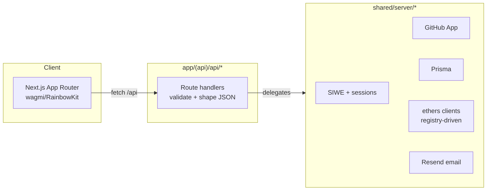
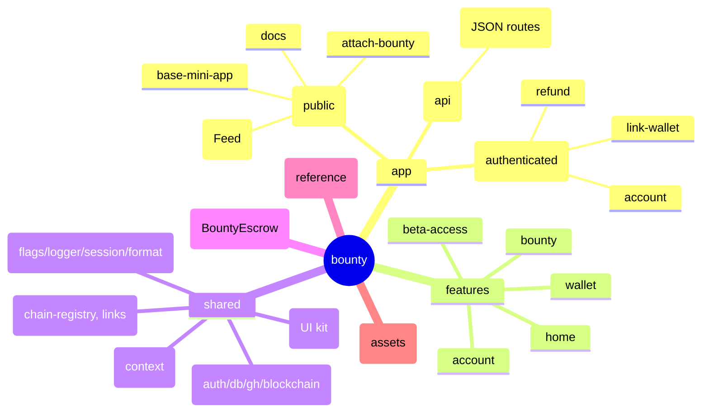

# Architecture

## Stack at a glance
- **Next.js App Router** serves all UI under `app/`, with shared providers in `shared/providers/*` and UI primitives in `shared/components`.
- **API routes** live in `app/(api)/api/*/route.js` and only validate/shape requests; heavy work is delegated to `shared/server/*`.
- **Postgres via Prisma** (`shared/server/db/schema.prisma` + `shared/server/db/prisma.js`) stores bounties, claims, wallets, users, allowlists, notifications, and beta access.
- **Blockchain** uses ethers v6 and a registry of aliases defined in `shared/config/chain-registry.js` to resolve RPCs, contracts, and token metadata.
- **GitHub App** (Octokit) powers OAuth, installations, issue comments, and webhook automation (`shared/server/github/*`).
- **Sessions & auth** rely on `iron-session` plus SIWE for wallet proof; feature flags come from Vercel Edge Config with optional local overrides.

## System overview

## Runtime map
- **Frontend shell** (`app/layout.jsx`): wraps pages with `Providers` (wagmi/RainbowKit/query), `NetworkProvider` (registry + env cookie), `BetaAccessProvider`, `FlagProvider`, `Navbar`, `Footer`, and `FlagsInspector`.
- **API layer**: thin handlers that respond with JSON and call server helpers. Everything uses the same `logger` with redaction.
- **Server helpers** (`shared/server`):
  - `auth/siwe.js` builds/verifies SIWE payloads.
  - `blockchain/contract.js` creates per-alias clients, computes bounty IDs, resolves payouts, and exposes parsing/formatting helpers.
  - `db/prisma.js` exposes query namespaces for bounties, wallets, claims, stats, users, allowlists, and beta access.
  - `github/*` initializes the App client, posts/updates comments, ensures labels, and dispatches webhook actions.
  - `notifications/email.js` sends Resend emails when configured.
  - `config.js` pulls env vars, normalizes GitHub secrets, builds resolver wallets per alias, and validates required config.
- **Shared config & utilities**: `shared/config/links.js` centralizes URLs; `shared/lib/*` covers logging, flags, sessions, formatting, and network cookie helpers.

## Key flows
- **Create bounty**: `/attach-bounty` gathers repo + funding details, the client funds on-chain, then calls `/api/bounty/create` which computes the bounty ID, stores it, and optionally posts a GitHub summary comment via `handleBountyCreated`.
- **Wallet linking**: client fetches `/api/nonce`, builds a SIWE message via `/api/siwe/message`, verifies it with `/api/verify-wallet` (stores wallet + chainId in session), then persists the GitHub ↔ wallet mapping through `/api/wallet/link`.
- **Claims and payouts**: `/api/webhooks/github` reacts to `pull_request` events. Claims are recorded when PRs mention funded issues, and merges trigger `resolveBountyOnNetwork`; DB status and PR comments are updated accordingly.
- **Allowlists**: sponsors manage per-bounty allowlists through `/api/allowlist/[bountyId]`. Reads gate payout eligibility and the dashboard UI.
- **Beta access**: contributors can apply (`/api/beta/apply`, `/api/beta/check`); admins review via dashboard tabs hitting `/api/beta/review` and `/api/beta/notify`.

## Repository layout
- `app/(public)` — Home feed, attach-bounty flow, docs landing, Base mini app wrapper.
- `app/(authenticated)` — Account dashboard (sponsored, earnings, settings, admin), link-wallet flow, refund utility.
- `app/(api)/api` — JSON endpoints (see `docs/reference/api.md`).
- `features/*` — Page-level logic and UI bundles (home, bounty funding, account, wallet, beta-access).
- `shared/components` — UI kit (Navbar/Footer, icons, badges, modals, inputs).
- `shared/providers` — Context providers for network, flags, beta access, wagmi, etc.
- `shared/server` — Server-only helpers described above plus Prisma schema.
- `contracts` — Solidity sources for the escrow contract; ABIs are mirrored in `shared/config/chain-registry.js`.
- `public` — Static assets and manifest files.

### Codebase outline

