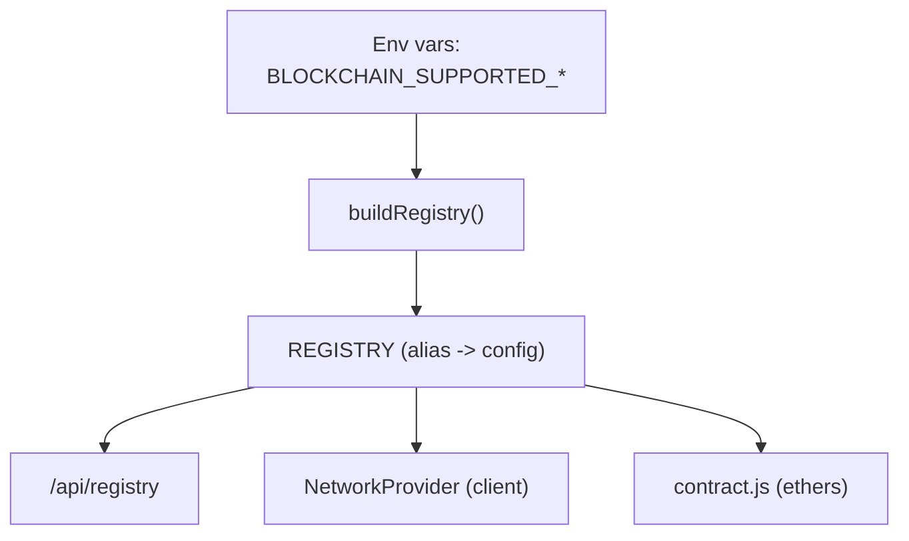

# Networks & Contracts

Network support is driven by the registry in `config/chain-registry.js`. Each alias declares RPC, chain metadata, escrow address, and token details; ethers ABIs for escrow/erc20 are defined in the same file.

## Supported aliases
- `BASE_MAINNET` (mainnet) — requires env-provided escrow/token addresses.
- `MEZO_MAINNET` (mainnet) — requires env-provided escrow/token addresses.
- `BASE_SEPOLIA` (testnet) — defaults: escrow proxy `0x7218b25e9fbA2974faF7b0056203Fd57591fF8F3` (upgradeable), token `USDC` at `0x036CbD53842c5426634e7929541eC2318f3dCF7e`.
- `MEZO_TESTNET` (testnet) — defaults: escrow proxy `0xA0d0dF8190772449bD764a52Ec1BcBCC8d556b38` (upgradeable), token `MUSD` at `0x118917a40FAF1CD7a13dB0Ef56C86De7973Ac503`.

Testnets fall back to the curated defaults above; mainnets must be fully configured through environment variables.

## Configuration
- Choose which aliases are enabled with `BLOCKCHAIN_SUPPORTED_TESTNET_ALIASES` and `BLOCKCHAIN_SUPPORTED_MAINNET_ALIASES` (comma-separated, e.g. `BASE_SEPOLIA,MEZO_TESTNET`).
- Required per-alias env keys when not using defaults: `<ALIAS>_RPC_URL`, `<ALIAS>_ESCROW_ADDRESS`, `<ALIAS>_TOKEN_ADDRESS`, `<ALIAS>_TOKEN_SYMBOL`, `<ALIAS>_TOKEN_DECIMALS`.
- Resolver wallet per alias: `<ALIAS>_OWNER_WALLET` and `<ALIAS>_OWNER_PRIVATE_KEY` (hex, 0x-prefixed). These are used by `resolveBountyOnNetwork`.
- Default alias per group: `BLOCKCHAIN_DEFAULT_TESTNET_ALIAS`, `BLOCKCHAIN_DEFAULT_MAINNET_ALIAS`. The `NetworkProvider` and `/api/network/default` rely on these.

## How the app uses the registry
- `/api/registry` exposes the full map to the client; `NetworkProvider` uses it to populate dropdowns and guard unsupported selections.
- Users store their preferred group (`testnet`/`mainnet`) in the `network_env` cookie via `/api/network/env`. Alias selection falls back to the default for that group.
- Bounty creation stores the alias, chainId, token symbol, and token address alongside the bounty. `/api/contract/bounty/[bountyId]` and payout flows use the saved alias to read/write on-chain.
- `/api/resolver?network=ALIAS` derives the resolver address from configured wallets; `/api/tokens` returns token metadata derived from the registry.

## Escrow ABI surface (summary, upgradeable version)

### Core functions
- `initialize(address primaryToken_, uint16 feeBps, address initialOwner)` — proxy initialization
- `createBounty(address resolver, bytes32 repoIdHash, uint64 issueNumber, uint64 deadline, uint256 amount)` — uses primary token
- `createBountyWithToken(address token, address resolver, bytes32 repoIdHash, uint64 issueNumber, uint64 deadline, uint256 amount)` — any allowed token
- `fund(bytes32 bountyId, uint256 amount)` — add to existing bounty
- `resolve(bytes32 bountyId, address recipient)` — pays claimer (before/at deadline)
- `refundExpired(bytes32 bountyId)` — returns funds to sponsor (after deadline only)

### Reads
- `getBounty(bytes32 bountyId)` → tuple (`repoIdHash`, `sponsor`, `resolver`, `token`, `amount`, `deadline`, `issueNumber`, `status`)
- `computeBountyId(address sponsor, bytes32 repoIdHash, uint64 issueNumber)`
- `primaryToken()`, `usdc()`, `usdcDecimals()` — legacy compatibility getters

### Multi-token fees
- `availableFees(address token)` — withdrawable fee balance for the given token
- `withdrawFees(address token, address to, uint256 amount)` — owner-only, withdraw to treasury
- `feeBps()` — current fee rate in basis points (max 1000 = 10%)
- `setFeeBps(uint16 newFeeBps)` — owner-only
- `totalFeesAccrued()` — cumulative all-time fees (informational)
- `totalEscrowedByToken(address token)` — locked escrow per token (internal tracking)

### Token allowlist
- `allowedTokens(address token)` — returns true if token is allowed
- `setAllowedToken(address token, bool allowed)` — owner-only

### Status enum
`None = 0`, `Open = 1`, `Resolved = 2`, `Refunded = 3` — **no cancel**.

### Pausing
- `pause()`, `unpause()` — owner-only
- When paused: `createBounty`, `createBountyWithToken`, `fund`, `resolve`, `refundExpired` are blocked.
- When paused: `withdrawFees`, `rescueToken`, `sweepNative` remain callable (admin can always withdraw).

Use `server/blockchain/contract.js` helpers for all contract interactions; they handle non-1559 networks and registry lookups for you.

## Add a new network
1. Add the alias to `CURATED_ALIASES` if it is not already present (or reuse an existing alias).
2. Set `BLOCKCHAIN_SUPPORTED_MAINNET_ALIASES` or `BLOCKCHAIN_SUPPORTED_TESTNET_ALIASES` to include the alias.
3. Provide `<ALIAS>_RPC_URL`, `<ALIAS>_ESCROW_ADDRESS`, `<ALIAS>_TOKEN_ADDRESS`, `<ALIAS>_TOKEN_SYMBOL`, `<ALIAS>_TOKEN_DECIMALS`, and owner wallet env vars.
4. Set `BLOCKCHAIN_DEFAULT_MAINNET_ALIAS`/`BLOCKCHAIN_DEFAULT_TESTNET_ALIAS` so `NetworkProvider` can pick defaults.
