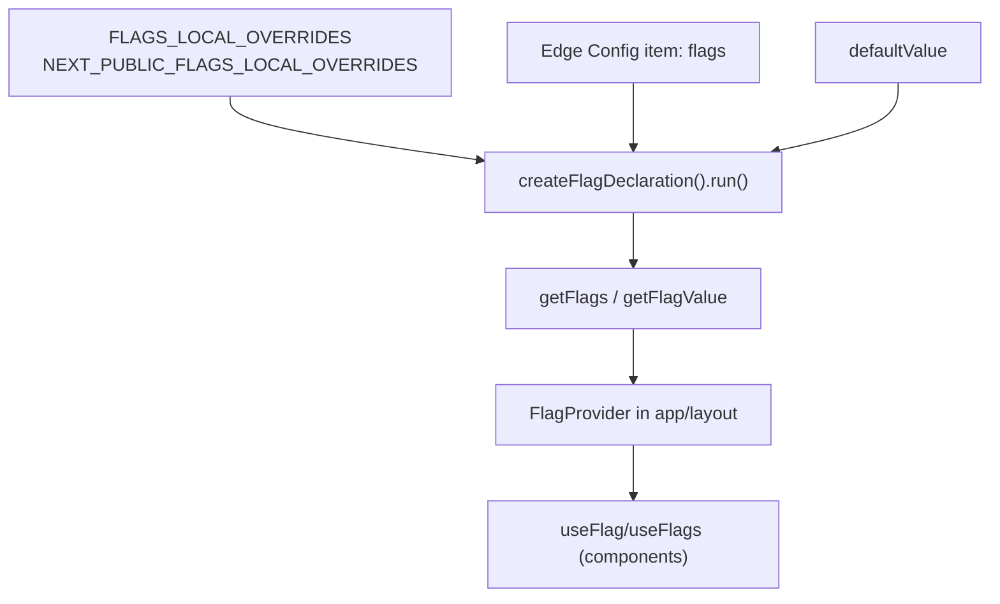

# Feature Flags

Flags are defined in `shared/lib/flags/index.js` using Vercel’s `flags/next` package. Values resolve in this order: `FLAGS_LOCAL_OVERRIDES` / `NEXT_PUBLIC_FLAGS_LOCAL_OVERRIDES` (JSON), Edge Config item `flags`, then the declaration’s `defaultValue`.



## Current flags
- `improvedNav` (`improved-nav`) — gated UI navigation changes.
- `betaWalletFlow` (`beta-wallet-flow`) — experimental wallet linking; only true when the user has beta access (transform applies).

## Define a new flag
```js
// shared/lib/flags/index.js
const newFeature = createFlagDeclaration({
  name: 'newFeature',
  key: 'new-feature',
  description: 'Short note on what it gates',
  defaultValue: false,
  options: [
    { label: 'Off', value: false },
    { label: 'On', value: true }
  ],
  // optional
  transform(value, identity) {
    return identity?.betaAccess ? value : false;
  }
});

export const flagRegistry = { ...flagRegistry, newFeature };
export { newFeature };
```
Add the key to Edge Config (or a local override) to enable it without redeploying.

## Reading flags
- **Server**: `const flags = await getFlags(); const enableBeta = await getFlagValue('betaWalletFlow');`
- **Client**: `const showNav = useFlag('improvedNav', false);`
- **Inspector**: `FlagsInspector` (mounted in `app/layout.jsx`) shows definitions/values for quick debugging.

## Configuring Edge Config
1. Set `EDGE_CONFIG` to a Vercel Edge Config that contains a JSON item named `flags`, e.g.:
   ```json
   { "improved-nav": false, "beta-wallet-flow": true }
   ```
2. Optional local overrides: `FLAGS_LOCAL_OVERRIDES='{"improved-nav":true}'` or `NEXT_PUBLIC_FLAGS_LOCAL_OVERRIDES` for client-visible toggles.

## When to use flags
- Gate UI experiments or gradual rollouts without code splits.
- Keep flag reads close to rendering logic (client) or branching (server). Do not thread individual booleans through deep prop chains—use `FlagProvider` + hooks.
