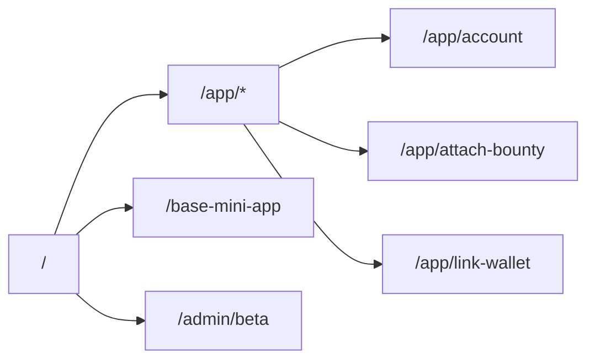

# Frontend Overview

The UI uses Next.js App Router with Tailwind CSS v4. Global styles are in `styles/globals.css`. `app/layout.jsx` wraps every page with wallet/network providers, beta access and flag providers, plus `Navbar`/`Footer`.



## Routes

| Path | Purpose | Data sources |
| --- | --- | --- |
| `/` | Landing page with hero, features, FAQ, and bounty feed preview. | Static content + `/api/bounties/open` |
| `/app` | Bounty feed with search and formatted amounts/deadlines. | `/api/bounties/open` via `useBountyFeed` |
| `/app/attach-bounty` | Post-GitHub-App funding flow. Shows install CTA if opened directly. | Query params from GitHub, `/api/resolver`, `/api/bounty/create` |
| `/app/account` | Dashboard tabs: Sponsored, Earnings, Settings, Controls, Admin (when allowed). | `/api/oauth/user`, `/api/user/*`, `/api/wallet/[id]`, `/api/github/installations`, `/api/admin/check` |
| `/app/link-wallet` | GitHub OAuth + SIWE signing + wallet mapping workflow. | `/api/nonce`, `/api/siwe/message`, `/api/verify-wallet`, `/api/wallet/link`, `/api/oauth/*` |
| `/base-mini-app` | Hybrid page for the Farcaster mini app—switches between Home/Dashboard/Profile without leaving the page. | Reuses Home + Account components |
| `/admin/beta` | Admin view for beta applications. | `/api/beta/applications`, `/api/beta/review`, `/api/beta/notify` |

## Providers

Located in `ui/providers/`:

- `Providers.jsx` — wagmi, RainbowKit, TanStack Query base config.
- `NetworkProvider.jsx` — loads `/api/registry`, manages `network_env` cookie, exposes `useNetwork`.
- `FlagProvider.jsx` + `FlagsInspector.jsx` — inject flag values into the client and expose toolbar data attributes.
- `BetaAccessProvider.jsx` — checks `/api/beta/check` and surfaces gating helpers.
- `AccountProvider.jsx` — dashboard-specific data context.
- `ErrorModalProvider.jsx` — global error modal management.

## Styling System

### Design Tokens (CSS Variables)

The design system is built on CSS custom properties in `styles/globals.css`:

**Typography:**
- `--font-inter` — Primary sans-serif font (Inter)
- `--font-instrument-serif` — Display serif font (Instrument Serif)

**Colors (oklch-based):**
- `--primary` — Dark brown (`oklch(0.25 0.02 60)`)
- `--foreground` / `--background` — Text and background colors
- `--muted` / `--muted-foreground` — Secondary text
- `--border` — Border color
- `--destructive` — Error/danger color

**Dark mode:** Automatically inverts via `.dark` class on html element.

### Utility Classes

Custom utilities defined in `styles/globals.css`:

```css
.font-inter        /* Primary font family */
.font-instrument-serif  /* Display serif */
.text-balance      /* text-wrap: balance */
.text-pretty       /* text-wrap: pretty */
.mix-blend-multiply
.backdrop-blur-custom
.scrollbar-hide
```

### Component Classes

```css
.nav-link          /* Navigation link styling */
.stat-card         /* Statistics card */
.bounty-tag        /* Bounty status tags */
.premium-btn       /* Primary CTA button */
.bounty-card       /* Bounty list card with hover */
```

### Animations

- `fadeIn` — Simple fade-in animation
- `fadeSlideIn` — Fade + slide up (for hero section)

## UI Components

Located in `ui/components/`:

- **Layout:** `Navbar.jsx`, `Footer.jsx`, `Socials.jsx`
- **Icons:** `Icons.jsx` — Consolidated SVG icons (PlusIcon, UserIcon, WalletIcon, etc.)
- **Feedback:** `StatusNotice.jsx`, `ErrorModal.jsx`
- **Data Display:** `UserAvatar.jsx`, `LinkFromCatalog.jsx`

## Page Components

Located in `ui/pages/*/`:

- `home/` — `LandingPage.jsx` (landing), `HomePage.jsx` (bounty feed)
- `account/` — `AccountContent.jsx`, `StatBlock.jsx`, tabs (`SponsoredTab`, `EarningsTab`, etc.), modals
- `bounty/` — `AttachBountySections.jsx`, `BountyCard.jsx`
- `wallet/` — `WalletLinkModal.jsx`
- `beta/` — `BetaAccessModal.jsx`, `BetaGate.jsx`
- `refund/` — Refund flow components

## Hooks

Located in `ui/hooks/`:

| Hook | Purpose |
| --- | --- |
| `useBountyFeed` | Fetches and filters open bounties |
| `useAccountPage` | Dashboard state management |
| `useGithubUser` | GitHub auth state |
| `useBetaAccess` | Beta access context |
| `useBetaApplications` | Admin beta application management |
| `useWalletManagement` | Wallet linking state |
| `useAttachBountyForm` | Bounty creation form state |
| `useAllowlistData` | Allowlist management |
| `useRefundFlow` | Refund transaction state |

## Adding a New Screen

1. Create page-specific components in `ui/pages/<feature-name>/`
2. Create hooks in `ui/hooks/` if needed
3. Create the route file in `app/<path>/page.jsx`
4. Use `useNetwork()` for chain metadata, `useFlag()` for feature gating
5. Follow existing patterns and reuse shared components
6. Keep typography/spacing aligned with `styles/globals.css`
