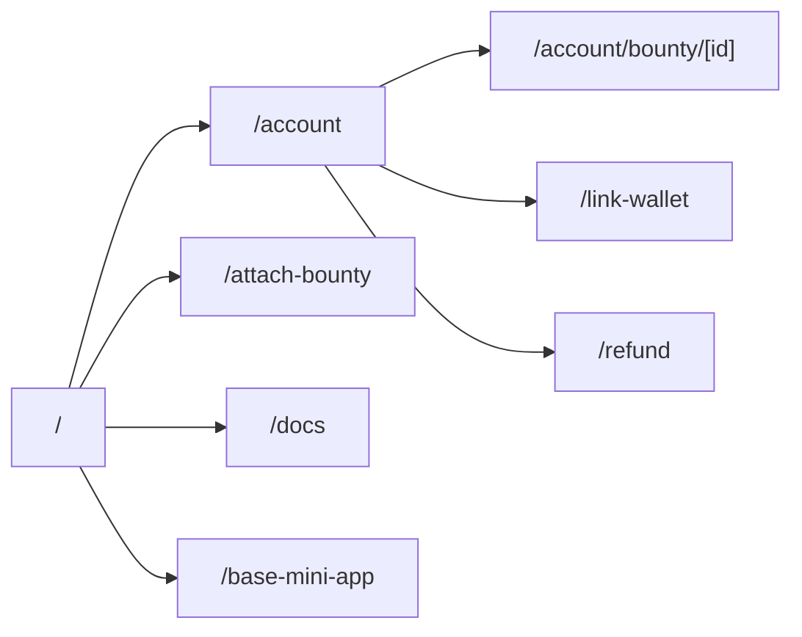

# Frontend Overview

The UI uses Next.js App Router with Tailwind (in `app/globals.css`). `app/layout.jsx` wraps every page with wallet/network providers, beta access and flag providers, plus `Navbar`/`Footer`. Color tokens are defined in CSS variables; legacy brand colors remain available as `--color-primary` etc.

## Routes
| Path | Purpose | Data sources |
| --- | --- | --- |
| `/` | Public bounty feed with search and formatted amounts/deadlines. | `/api/bounties/open` via `useBountyFeed` |
| `/attach-bounty` | Post-GitHub-App funding flow. Shows install CTA if opened directly. | Query params from GitHub, `/api/resolver`, `/api/bounty/create` |
| `/docs` | In-app pointer to the markdown API reference. | Static content linking to `docs/reference/api.md` |
| `/base-mini-app` | Hybrid page for the Base mini app—switches between Home/Dashboard/Profile without leaving the page. | Reuses Home + Account components |
| `/account` | Dashboard tabs: Sponsored, Earnings, Settings, Admin (when allowed). | `/api/oauth/user`, `/api/user/*`, `/api/wallet/[id]`, `/api/github/installations`, `/api/admin/check` |
| `/link-wallet` | GitHub OAuth + SIWE signing + wallet mapping workflow. | `/api/nonce`, `/api/siwe/message`, `/api/verify-wallet`, `/api/wallet/link`, `/api/oauth/*` |
| `/refund` | Simple refund utility for expired bounties. | Wallet connection + on-chain call |
| `/admin/beta` | Admin view for beta applications (uses the same data as the Account admin tab). | `/api/beta/applications`, `/api/beta/review`, `/api/beta/notify` |

## Providers
- `shared/providers/Providers` — wagmi, RainbowKit, TanStack Query base config.
- `shared/providers/NetworkProvider` — loads `/api/registry`, manages `network_env` cookie, exposes `useNetwork`.
- `shared/providers/FlagProvider` + `FlagsInspector` — inject flag values into the client and expose toolbar data attributes.
- `features/beta-access/providers/BetaAccessProvider` — checks `/api/beta/check` and surfaces gating helpers.

## UI building blocks
- Layout components: `Navbar`, `Footer`, `Socials`.
- Icons and badges: `shared/components/Icons.jsx`, `shared/components/Badge.jsx`, `shared/components/LinkFromCatalog` (centralized external links).
- Domain components: `features/home/components/HomePage`, `features/bounty/components/AttachBountySections`, `features/account/components/AccountContent` (tabs + modals), `features/wallet` modals.

## Adding a screen quickly
1. Build data-fetching in a feature module (hook/component) under `features/*`.
2. Create the route file in `app/(public|authenticated)/.../page.jsx` and wrap with the existing layout shell (already applied globally).
3. Use `useNetwork` when you need chain metadata and `useFlag` for gated UI.
4. Keep spacing/typography aligned with `globals.css` and reuse shared components before adding new ones.
