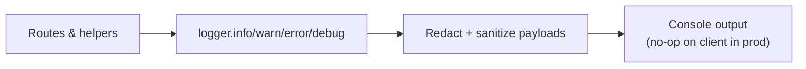

# Logging

`shared/lib/logger` wraps `console` with sensible defaults and redaction. It is safe to import from both server and client code; client logging is silenced in production builds.



## Behavior
- Prefixes messages with `[SERVER]` or `[CLIENT]` and the level (`INFO|WARN|ERROR|DEBUG`).
- Redacts sensitive keys (`authorization`, `cookie`, `token`, `secret`, etc.) and long or token-shaped strings.
- Sanitizes `Error`, `Date`, `URL`, ArrayBuffers, circular objects, and BigInts before printing.
- In production on the client, logs are no-ops to avoid leaking data.

## Usage
Import `logger` and prefer structured objects over string interpolation:
```js
import { logger } from '@/shared/lib/logger';

logger.info('Creating bounty', { repoFullName, network });
logger.warn('Unexpected network', { alias, supported: Object.keys(REGISTRY) });
logger.error('Webhook failed', error);
```

## Create a project-specific helper
If you need consistent fields, wrap the logger rather than sprinkling string literals:
```js
// shared/server/github/log.js
import { logger } from '@/shared/lib/logger';
export const ghLog = {
  event: (type, payload) => logger.info('GitHub event', { type, action: payload.action }),
  failure: (context, error) => logger.error('GitHub handler failed', { context, error })
};
```
Keep redaction in mind—pass tokens/headers as separate variables only when necessary and rely on the sanitizer to scrub sensitive keys.
