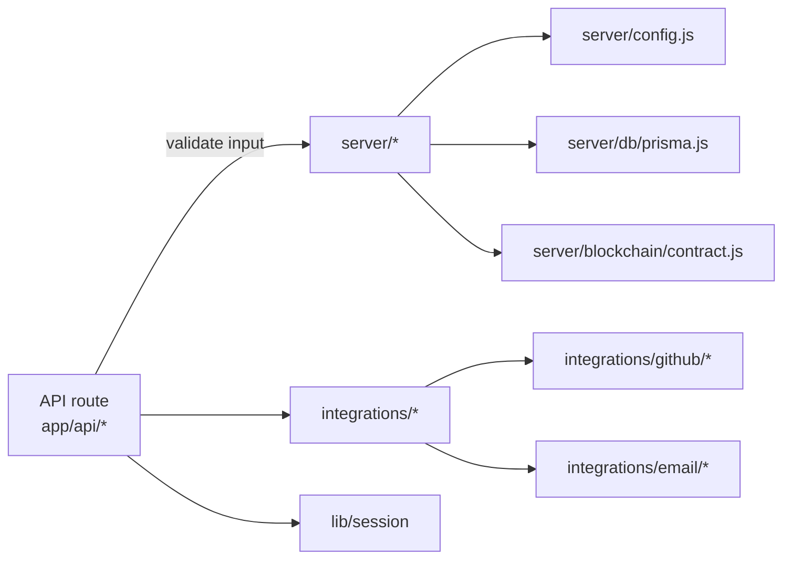

# Server Layer

Next.js API routes call into `server/*` and `integrations/*` for everything beyond basic validation. Helpers are written for the Node runtime and should not be imported from client components.



## Server Modules

| Path | Responsibility |
| --- | --- |
| `server/config.js` | Loads env vars (session secret, frontend URL, ENV_TARGET, GitHub creds), builds resolver wallets per alias from the registry, exposes token metadata, and validates required settings. |
| `server/auth/siwe.js` | Generates SIWE nonces, builds/validates messages, and chooses default chainIds based on the registry. |
| `server/blockchain/contract.js` | Creates per-alias ethers clients, computes bounty IDs, reads contract state, and resolves payouts (handles non-1559 gas for Mezo). |
| `server/blockchain/validation.js` | Normalizes and validates addresses, tx hashes, and bytes32 IDs before contract calls. |
| `server/db/schema.prisma` | Prisma schema for Postgres; see `docs/reference/database.md`. |
| `server/db/prisma.js` | Prisma client plus query namespaces for bounties, wallets, claims, users, allowlists, stats, and beta access; converts BigInt fields to JS numbers. |

## Integration Modules

| Path | Responsibility |
| --- | --- |
| `integrations/github/client.js` | Initializes the GitHub App (Octokit), posts/updates comments, ensures labels, parses PR bodies for issue references. |
| `integrations/github/webhooks/index.js` | Dispatches verified GitHub events to issue/PR handlers, formats bounty comments, and escalates errors to maintainers. |
| `integrations/github/templates/` | GitHub comment templates (bounty created, payment sent, etc.). |
| `integrations/github/services/` | Bounty formatting, maintainer alerts. |
| `integrations/email/email.js` | Nodemailer email sender (no-op when not configured). |
| `integrations/email/templates/` | Email templates (bounty paid, expiration notices, beta notifications). |

## Library Modules

| Path | Responsibility |
| --- | --- |
| `lib/session/` | Wraps `iron-session` with secure cookies (`bountypay_session`). |
| `lib/logger/` | Structured logging with redaction for sensitive data. |
| `lib/flags/` | Feature flag definitions and resolution. |
| `lib/format/` | Amount, date, and deadline formatting utilities. |

## Sessions and Auth

- `lib/session` wraps `iron-session` with secure cookies (`bountypay_session`). Domain is derived from `FRONTEND_URL`; secure cookies are enforced in production.
- OAuth flows populate `session.githubId`, `session.githubUsername`, `session.githubAccessToken`, `session.email`, `session.avatarUrl`. SIWE verification stores `session.walletAddress` and `session.chainId`.
- Admin checks rely on `ADMIN_GITHUB_IDS` (comma-separated GitHub IDs in env).

## Webhooks

- `/api/webhooks/github` validates the signature before calling `handleWebhook`.
- `issues.opened` triggers CTA comments; `pull_request.opened/edited` records claims when issues are referenced; `pull_request.closed` (merged) resolves payouts via `resolveBountyOnNetwork` and updates DB + comments.
- `handleBountyCreated` is reused by `/api/bounty/create` to post the pinned bounty summary.

## Add a New API Route

1. Create `app/api/<name>/route.js`.
2. Validate inputs and sessions early; return `{ error }` with a status when invalid.
3. Call the appropriate helper in `server/*` or `integrations/*` (never Prisma directly from routes).
4. Log meaningful events with `logger` from `@/lib/logger` and keep responses small and JSON-only.

## Import Patterns

```javascript
// Server modules
import { CONFIG } from '@/server/config.js';
import { bountyQueries } from '@/server/db/prisma.js';
import { resolveBountyOnNetwork } from '@/server/blockchain/contract.js';

// Integration modules
import { getOctokit } from '@/integrations/github/client.js';
import { sendBountyPaidEmail } from '@/integrations/email/email.js';

// Library modules
import { getSession } from '@/lib/session';
import { logger } from '@/lib/logger';
```
