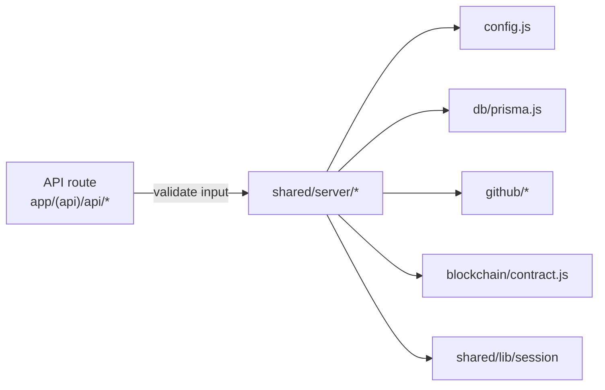

# Server Layer

Next.js API routes call into `shared/server/*` for everything beyond basic validation. Helpers are written for the Node runtime and should not be imported from client components.

## Modules
| Path | Responsibility |
| --- | --- |
| `config.js` | Loads env vars (session secret, frontend URL, ENV_TARGET, GitHub creds), builds resolver wallets per alias from the registry, exposes token metadata, and validates required settings. |
| `auth/siwe.js` | Generates SIWE nonces, builds/validates messages, and chooses default chainIds based on the registry. |
| `blockchain/contract.js` | Creates per-alias ethers clients, computes bounty IDs, reads contract state, and resolves payouts (handles non-1559 gas for Mezo). |
| `blockchain/validation.js` | Normalizes and validates addresses, tx hashes, and bytes32 IDs before contract calls. |
| `db/schema.prisma` | Prisma schema for Postgres; see `docs/reference/database.md`. |
| `db/prisma.js` | Prisma client plus query namespaces for bounties, wallets, claims, users, allowlists, stats, and beta access; converts BigInt fields to JS numbers. |
| `github/client.js` | Initializes the GitHub App (Octokit), posts/updates comments, ensures labels, parses PR bodies for issue references. |
| `github/webhooks/index.js` | Dispatches verified GitHub events to issue/PR handlers, formats bounty comments, and escalates errors to maintainers. |
| `notifications/email.js` | Resend email sender (no-op when not configured). |

## Sessions and auth
- `shared/lib/session` wraps `iron-session` with secure cookies (`bountypay_session`). Domain is derived from `FRONTEND_URL`; secure cookies are enforced in production.
- OAuth flows populate `session.githubId`, `session.githubUsername`, `session.githubAccessToken`, `session.email`, `session.avatarUrl`. SIWE verification stores `session.walletAddress` and `session.chainId`.
- Admin checks rely on `ADMIN_GITHUB_IDS` (comma-separated GitHub IDs in env).

## Webhooks
- `/api/webhooks/github` validates the signature before calling `handleWebhook`.
- `issues.opened` triggers CTA comments; `pull_request.opened/edited` records claims when issues are referenced; `pull_request.closed` (merged) resolves payouts via `resolveBountyOnNetwork` and updates DB + comments.
- `handleBountyCreated` is reused by `/api/bounty/create` to post the pinned bounty summary.

Prefer adding new server functionality here and keeping route handlers thin; anything reusable across handlers belongs in these modules.

## Add a new API route (pattern)
1. Create `app/(api)/api/<name>/route.js`.
2. Validate inputs and sessions early; return `{ error }` with a status when invalid.
3. Call the appropriate helper in `shared/server/*` (never Prisma directly from routes).
4. Log meaningful events with `logger` and keep responses small and JSON-only.
